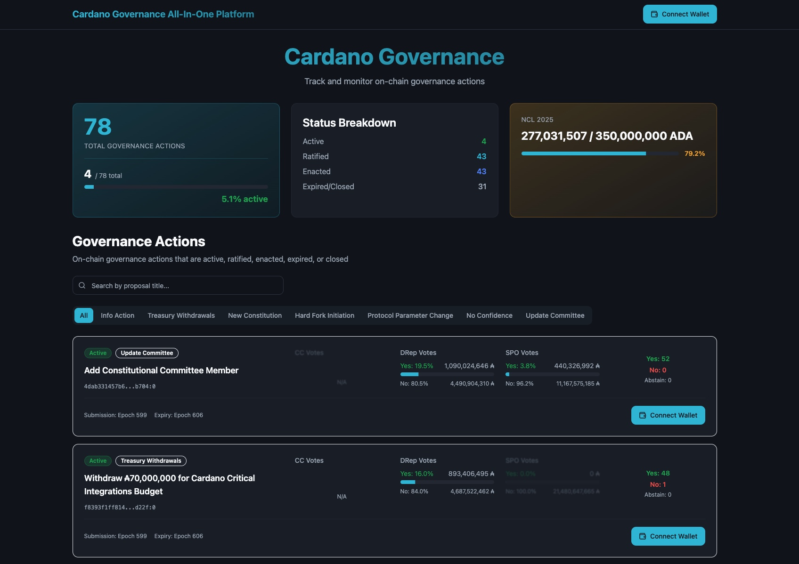
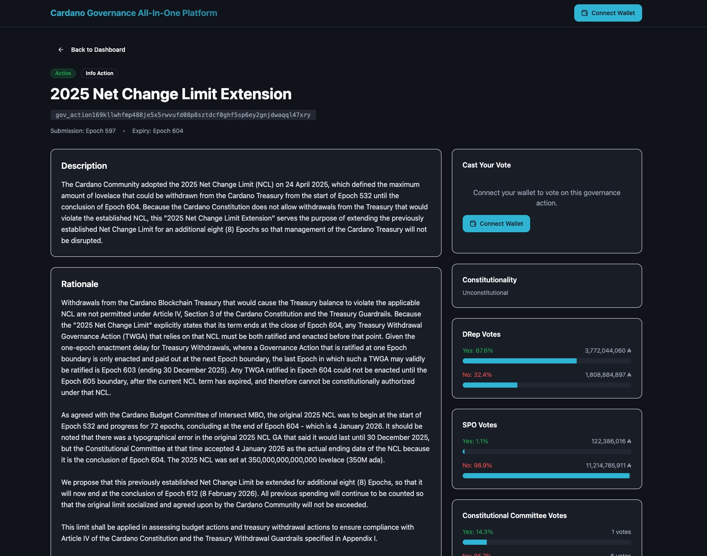
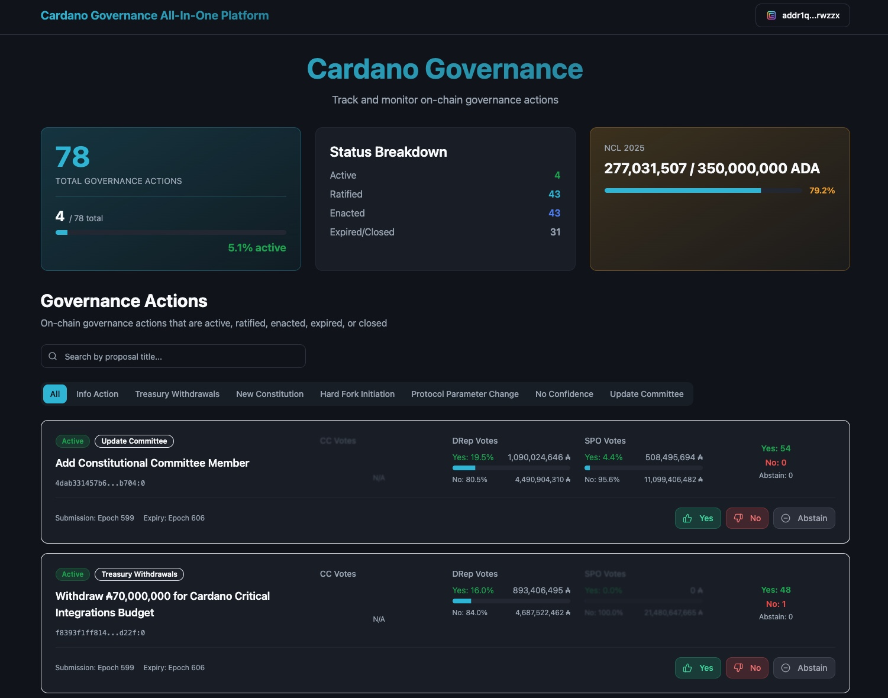
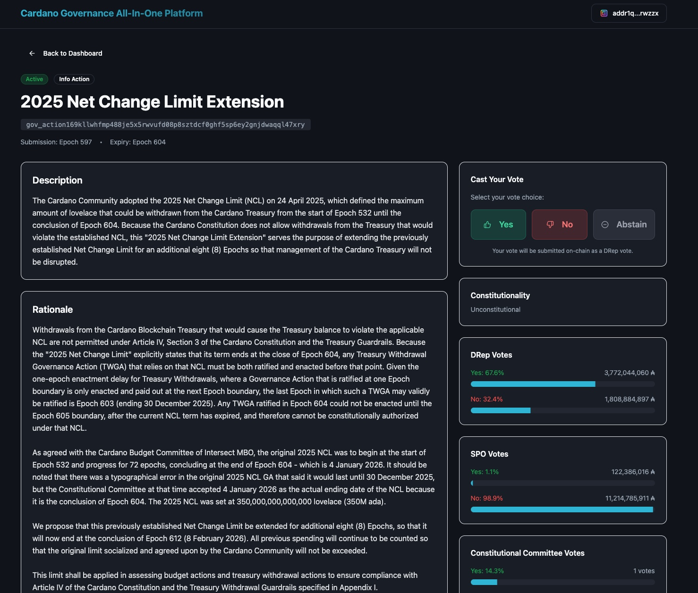
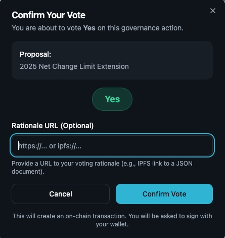
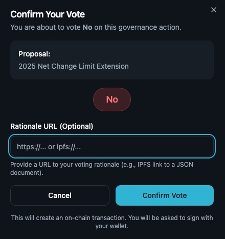
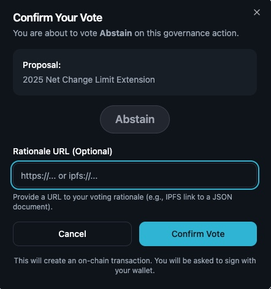
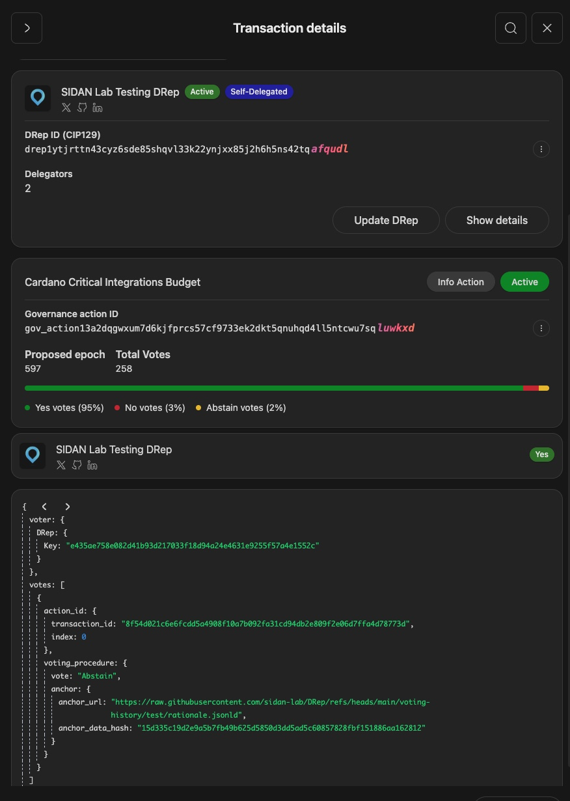
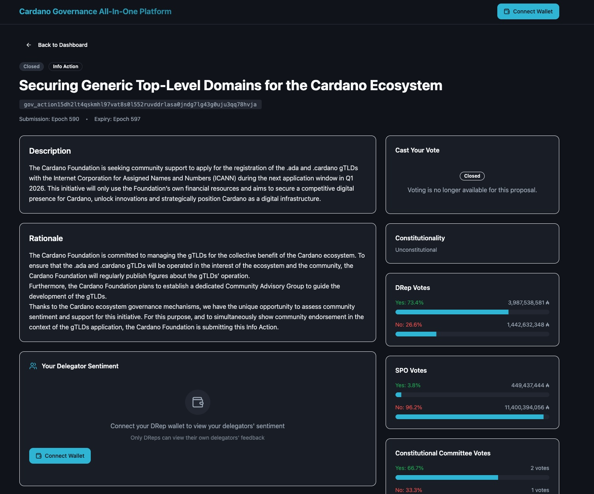
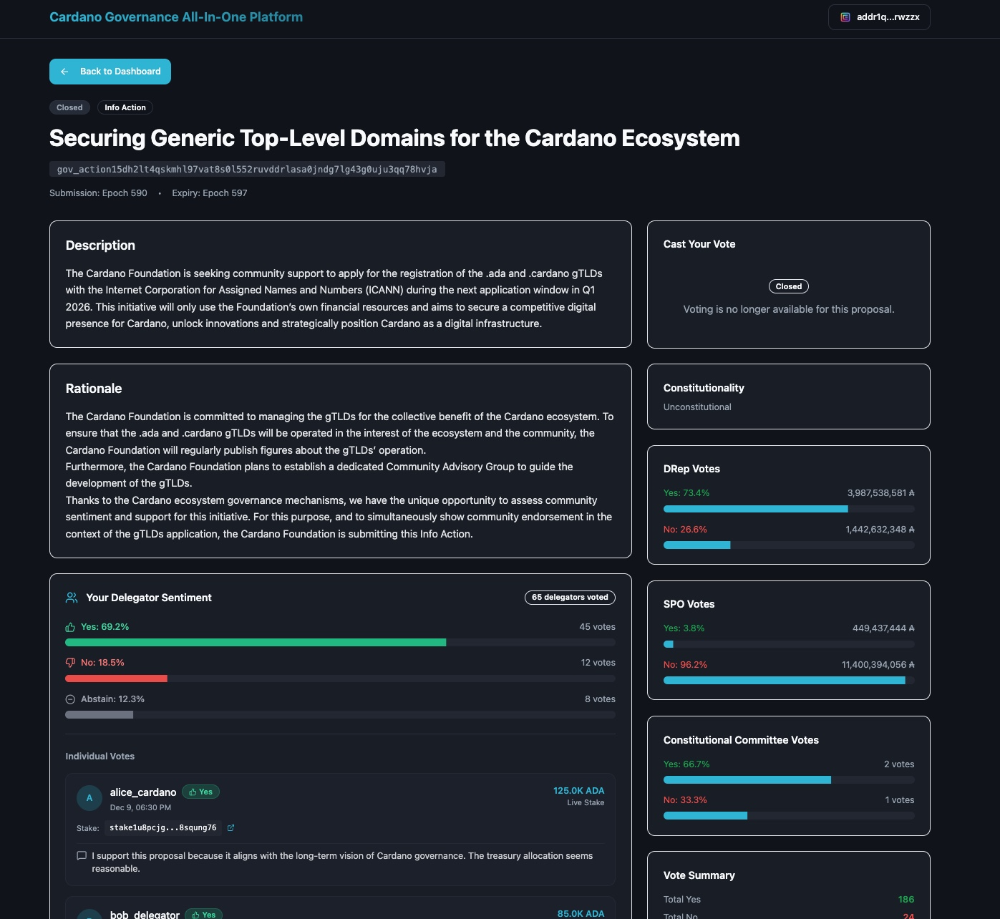

# Milestone 2: Governance Action Viewing and Voting Platform (incl. Visualization of mock Delegator Sentiment)

## Overview

This milestone delivers the development of web platform, showing governance action and build with voting feature and visualization of mock delegator sentiment data for Cardano governance actions. DReps can now view aggregated feedback from their delegators on each governance proposal, helping them make more informed voting decisions that reflect their community's preferences.

## UIUX Design of the Governance Platform

We would like to position the Governance Platform to be an all-in-one governance platform covering governance action viewing, voting on governance action, and viewing delegator sentiment. There are 2 main pages related to the platform - Landing page and Proposal Details page.

### Landing Page

The landing page consists of (1) High-level summary of cardano governance actions status; (2) List of active and historical governance actions. For the high-level summary, it shows the total number of active, ratified, enacted, expired/ closed proposal. Besides, the NCL status of the current year is also displayed. Users can filter the the active and historical governance actions by governance action type (e.g. Info Action, Treasury Withdrawals, New Constitution, Hard Fork Initiation, Protocol Parameter Change, No Confidence and Update Committe) or proposal title. For each governance action, the relevant proposal information is displayed (e.g. Proposal title, Type of governance action, Yes %, No %, No. of Yes vote count, No. of No vote count, Submission and expiry epoch, etc.). The irrelevant voter type will be blurred based on governance action types. The design aims at providing user with an overview of Cardano governance in general and overview of each proposal. Some of the figures below show the UI of it.

### Proposal Details Page

The proposal details page consists of the detailed description, rationale, current voting per different voter types, delegator sentiment, and individual voting records per proposal. Some of the figures below show the UI of it. The design aims at providing user with a detailed information per governance action and helping user to make more informed governance voting. Some of the figures below show the UI of it.

## Expected Output: Governance Action Voting

### Vote Types

The platform supports three voting options for governance actions:

| Vote Type   | Description                         | Visual Indicator                         |
| ----------- | ----------------------------------- | ---------------------------------------- |
| **Yes**     | Support for the governance action   | Green progress bar with thumbs-up icon   |
| **No**      | Opposition to the governance action | Red progress bar with thumbs-down icon   |
| **Abstain** | Neutral position / No opinion       | Gray progress bar with minus-circle icon |

### Expected output of governance action voting (Yes & No & Abstain)

Before successful wallet connection, DRep can only see the Connect Wallet button shown in active proposals (in both landing and proposal details pages)

<figure>
  
  <figcaption><em>Figure: Wallet not connected - Landing Page</em></figcaption>
</figure>

<figure>
  
  <figcaption><em>Figure: Wallet not connected - Proposal Details Page</em></figcaption>
</figure>

After successful wallet connection, DRep can either vote on the landing page or the proposal details page.

<figure>
  
  <figcaption><em>Figure: Wallet connected - Landing Page</em></figcaption>
</figure>

<figure>
  
  <figcaption><em>Figure: Wallet connected - Proposal Details Page</em></figcaption>
</figure>

After clicking the respective vote option button (yes/ no/ abstain), a pop-up window will be shown and allow user to review the voting details (proposal, voting option) and attach a rationale URL as supplementatry information in the onchain voting transaction to be signed and submitted to the Cardano blockchain. After confirmation, user will be required to sign the transaction. After successful signature, the blockchain transaciton will be submitted to Cardano blockchain. User can check the blockchain transaction confirmation status in its cardano wallet to confirm the voting.

<div style="display: flex; justify-content: center; gap: 10px;">
  <figure style="text-align: center;">
    
    <figcaption><em>Figure: Yes vote confirmation</em></figcaption>
  </figure>
  <figure style="text-align: center;">
    
    <figcaption><em>Figure: No vote confirmation</em></figcaption>
  </figure>
  <figure style="text-align: center;">
    
    <figcaption><em>Figure: Abstain vote confirmation</em></figcaption>
  </figure>
</div>

<figure>
  
  <figcaption><em>Figure: Cardano wallet governance action confirmation</em></figcaption>
</figure>

## Expected Output: visualization of mock Delegator Sentiment

### Expected output of visualization of mock Delegator Sentiment (when Drep wallet is connected or not)

Before successful wallet connection, DRep can only see the Connect Wallet button shown in proposals details pages. No delegator sentiment data will be shown.

<figure>
  
  <figcaption><em>Figure: DRep wallet not connected - delegator sentiment</em></figcaption>
</figure>

After successful wallet connection, DRep can see associated delegator sentiment data in proposals details pages.

<figure>
  
  <figcaption><em>Figure: DRep wallet connected - delegator sentiment</em></figcaption>
</figure>

## Local Deployment Guide

### Sync all governance data in your local database and keep your backend running

Define your own .env under the API folder based on the .env.example file

Run below commands to sync all governance data in your local database first (It would take a couple of hours to sync your local database to all governance actions in Cardano mainnet so far). After syncing your local database, you could keep the backend running

```bash
cd api
npm install
npm run build
npm run dev
```

### Run the frontend

Define your own .env under the frontend folder based on the .env.example file

Open another terminal and run below commands to start and run your frontend in your local environment

```bash
cd frontend
npm install
npm run build
npm run dev
```

Once the frontend is running in your terminal, you could open it in your browser and start trying the application locally
